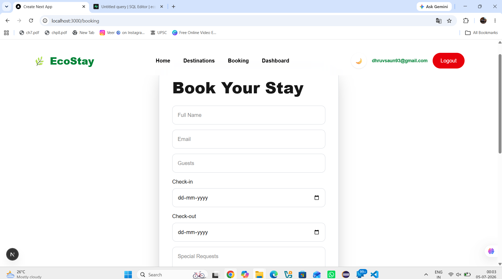
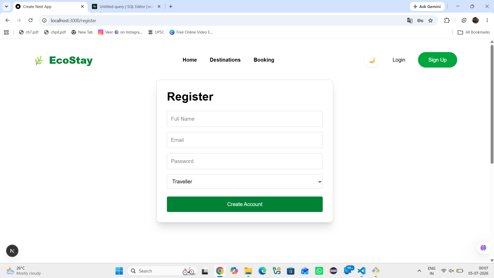
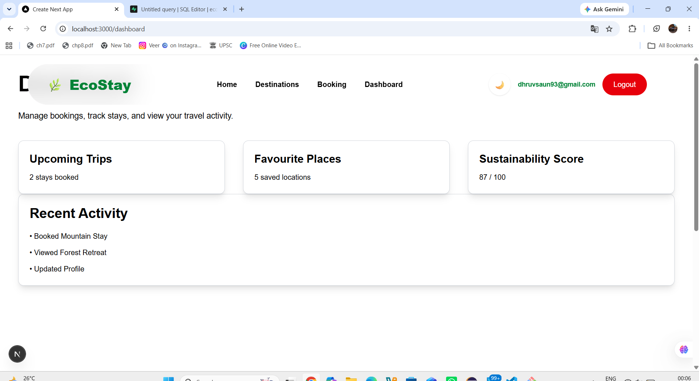

# 🌿 EcoStay Connect – AI Powered Homestay Platform

EcoStay Connect is a full-stack web application that promotes sustainable tourism by connecting travelers with eco-friendly homestays. The platform enables users to browse homestays, create accounts, log in securely, and book accommodations through a modern web interface.

Developed as part of an internship program, the project follows milestone-based weekly deliverables.

---

# 📌 Sector

**Homestay & Eco-Tourism**

---

# 📖 Project Description

EcoStay Connect is an AI-powered homestay discovery and booking platform designed to support sustainable tourism.

Users can:

* Browse eco-friendly homestays
* Explore destinations
* Register and log in securely
* View homestay details
* Book accommodations
* Switch between Dark and Light mode

Future versions will include AI-based recommendations, personalized travel suggestions, and smart search capabilities.

---

# 🚀 Tech Stack

## Frontend

* Next.js 16
* React
* TypeScript
* Tailwind CSS

## Backend

* FastAPI (Python)

## Database

* PostgreSQL (Supabase)

## Authentication

* Supabase Authentication

## Version Control

* Git
* GitHub

---

# ✨ Features Implemented

## Frontend

* Responsive Homepage
* Navigation Bar
* Hero Section
* Featured Destinations
* Homestay Listing Page
* Booking Page
* User Dashboard
* Login Page
* Registration Page
* Dark / Light Theme
* Responsive Layout

## Backend

* FastAPI REST APIs
* CRUD Operations
* Search Endpoint
* Validation
* Error Handling
* Swagger Documentation

## Database (Supabase)

* Homestays Table
* Bookings Table
* User Authentication
* Row Level Security (RLS)
* Secure Booking Storage

## Authentication

* User Registration
* Email Verification
* User Login
* User Logout
* Session Persistence
* Protected Authentication using Supabase

---

# 🔌 Backend API Endpoints

| Method | Endpoint          | Description       |
| ------ | ----------------- | ----------------- |
| GET    | /homestays        | Get all homestays |
| GET    | /homestays/{id}   | Get one homestay  |
| POST   | /homestays        | Create homestay   |
| PUT    | /homestays/{id}   | Update homestay   |
| DELETE | /homestays/{id}   | Delete homestay   |
| GET    | /homestays/search | Search homestays  |

---

# 🗄 Database Schema

The project uses PostgreSQL (Supabase).

Database schema:

```
Users
 ├── id (UUID)
 ├── full_name
 └── email

Homestays
 ├── id
 ├── title
 ├── location
 ├── description
 ├── image_url
 └── price

Bookings
 ├── id
 ├── user_id
 ├── homestay_id
 ├── guests
 ├── checkin
 ├── checkout
 ├── requests
 └── created_at
```

ER Diagram:

```
docs/database-schema.png
```

---

# 📂 Project Structure

```
EcoStay-Connect---AI-Powered-Homestay

backend/
frontend/
docs/
screenshots/
README.md
```

---

# ⚙️ Running Frontend

```bash
git clone <repository-url>

cd EcoStay-Connect---AI-Powered-Homestay

cd frontend

npm install

npm run dev
```

Frontend runs at:

```
http://localhost:3000
```

---

# ⚙️ Running Backend

Open another terminal.

```bash
cd backend

python -m venv .venv

.venv\Scripts\activate

pip install -r requirements.txt

uvicorn app.main:app --reload
```

Backend:

```
http://localhost:8000
```

Swagger:

```
http://localhost:8000/docs
```

---

# 🔐 Environment Variables

Frontend:

```
frontend/.env.local
```

Example:

```
NEXT_PUBLIC_SUPABASE_URL=your_project_url

NEXT_PUBLIC_SUPABASE_ANON_KEY=your_anon_key
```

Backend:

```
backend/.env
```

Example:

```
DATABASE_URL=
SUPABASE_URL=
SUPABASE_KEY=
```

---

# 📸 Screenshots

## Homepage


---

## Homestays Page


---

## Booking Page



---

## Login Page


---

## Registration Page



---

## Dashboard



---

## Week 1 Progress


---

# 📅 Weekly Progress

## ✅ Week 1

* Project Planning
* Documentation
* UI Design
* Repository Setup

## ✅ Week 2

* Homepage
* Navigation
* Homestay Listing
* Responsive UI

## ✅ Week 3

* Dashboard
* Booking UI
* Login UI
* Registration UI
* Theme Switching

## ✅ Week 4

* FastAPI Backend
* REST APIs
* CRUD Operations
* Frontend–Backend Integration

## ✅ Week 5

* PostgreSQL (Supabase)
* Database Integration
* Authentication
* Email Verification
* Login & Logout
* Booking Storage
* Row Level Security (RLS)

---

# 🧠 Future Improvements

* AI Recommendation System
* Smart Search
* User Profiles
* Booking History
* Reviews & Ratings
* Host Dashboard
* Payment Gateway Integration

---

# 👨‍💻 Developed By

**Dhruv Saun**

Internship Project – 2026
