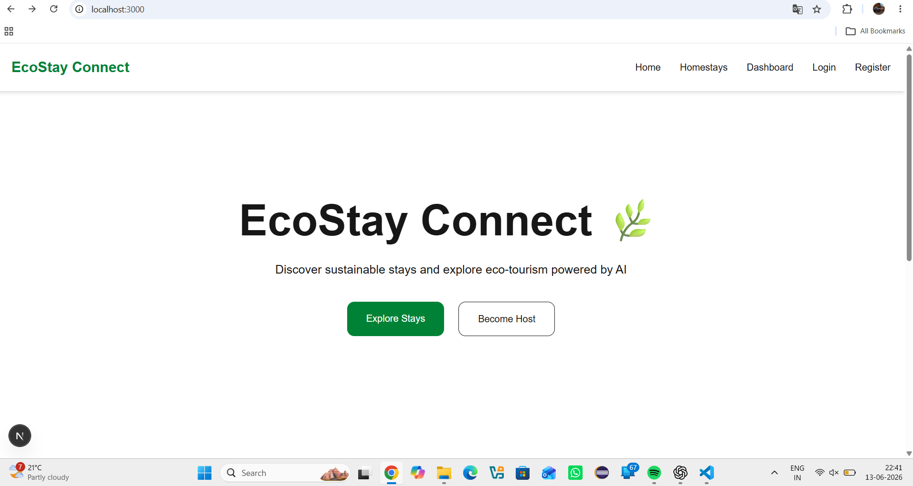
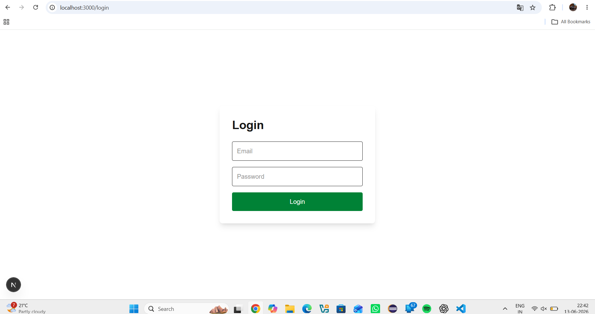
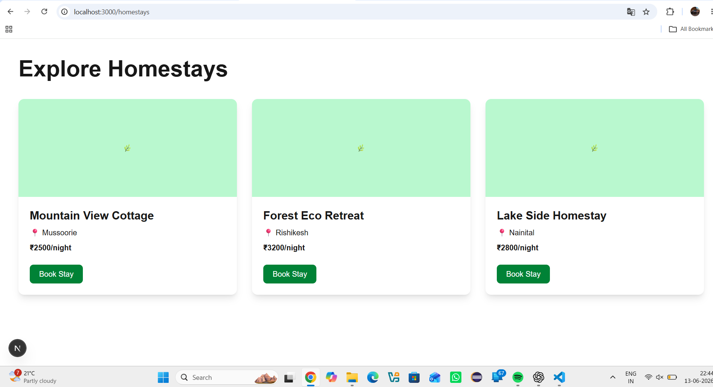
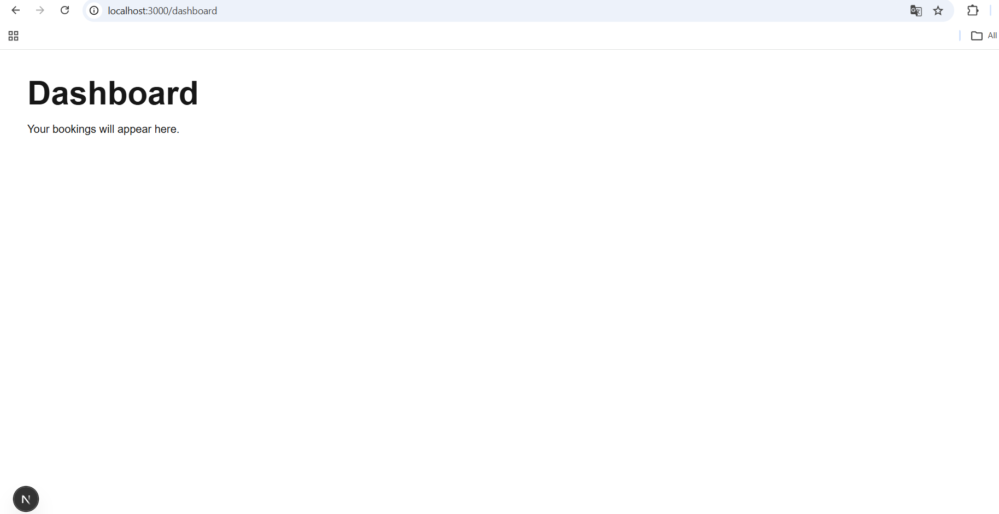

# 🌿 EcoStay Connect – AI Powered Homestay Platform
EcoStay Connect is a full-stack web application designed to support sustainable tourism and eco-friendly homestay discovery.
The platform helps users explore homestays, view stay details, and book accommodations through a modern web experience.
This project is being developed as part of an internship program and follows weekly milestone-based progress.
---
# 📌 Sector
Homestay & Eco-Tourism
---
# 📖 Project Description
EcoStay Connect is an AI-powered homestay discovery and booking platform that connects travelers with eco-friendly stays.
Users can browse available homestays, explore sustainable travel options, register, and book stays through a simple interface.
Future versions will integrate AI-based recommendations, smart search, booking management, and personalized travel experiences.
---
# 🚀 Tech Stack
## Frontend
- Next.js
- React.js
- Tailwind CSS
## Backend (Upcoming)
- Python FastAPI
## Database (Upcoming)
- PostgreSQL via Supabase
## Version Control
- Git
- GitHub
---
# ✨ Current Features (Week 3)

✅ Responsive Homepage
✅ Navigation Bar
✅ Hero Section
✅ Featured Stays Section
✅ Search UI
✅ Login Page UI
✅ Register Page UI
✅ Homestay Listing Page
✅ Booking Page UI
✅ Dashboard Page
✅ Routing using Next.js
✅ Reusable Component Library
✅ Dark / Light Mode Toggle
✅ Responsive Dashboard Layout
✅ Theme Provider Integration
✅ Responsive Screenshots Support
✅ Component Showcase Page 
---
# 🧠 Planned AI Features
- AI-powered homestay recommendations
- Smart search and filtering
- Personalized travel suggestions
- Stay popularity prediction
- User preference analysis
---
# 📂 Project Structure
```EcoStay-Connect---AI-Powered-Homestay
│
├── frontend
│   ├── app
│   │   ├── login
│   │   ├── register
│   │   ├── homestays
│   │   ├── booking
│   │   ├── dashboard
│   │   ├── showcase
│   │   ├── layout.tsx
│   │   └── page.tsx
│   │
│   ├── components
│   │   ├── Navbar.tsx
│   │   ├── Hero.tsx
│   │   ├── Footer.tsx
│   │   ├── Card.tsx
│   │   ├── ThemeProvider.tsx
│   │   └── ui
│
├── backend
├── docs
├── diagrams
├── screenshots
└── README.md
```
---
# 🖥️ Pages Implemented
### Home Page
Landing page with hero section and featured stays.
### Login Page
User authentication interface.
### Register Page
New user registration screen.
### Homestays Page
Displays available homestay cards.
### Booking Page
Booking UI for selected stay.
### Dashboard
Displays future booking information.
---
## 📸 Screenshots

### Homepage



### Login Page



### Homestays



### Dashboard



### Week 3 UI Deliverables
- Wireframes
- Lo-fi wireframes created in Figma
### Component Library
- Button
- Input
- Modal
- Toast
- Loader
### Responsiveness
- Mobile (375px)
- Tablet (768px)
- Desktop (1440px)
### Theme Support
Dark Mode
Light Mode

### Week 1 Progress


Add screenshots inside:
```plaintext
screenshots/
```
Example:
```md
## Homepage

## Homestays

```
---
# ⚙️ Installation
Clone repository:
```bash
git clone <YOUR_GITHUB_REPO_LINK>
```
Open project:
```bash
cd EcoStay-Connect---AI-Powered-Homestay
```
Install frontend:
```bash
cd frontend
npm install
```
Run project:
```bash
npm run dev
```
Open:
```plaintext
http://localhost:3000
```
---
# 📅 Progress Status
### Week 1
- Documentation
- Architecture
- Planning
### Week 2
- Frontend Development
- UI Creation
- Routing
### Week 3
- UI/UX Wireframes
- Component Library
- Responsive Design
- Dark / Light Mode
- Dashboard Improvements
### Week 4 (Upcoming)
- FastAPI Backend
- Supabase Integration
- Authentication APIs
---
## Upcoming Features
- FastAPI backend
- Supabase integration
- AI recommendation engine
- Authentication
- Booking management
- User profile system
# 👨‍💻 Developed By
Dhruv Saun
Internship Project – 2026